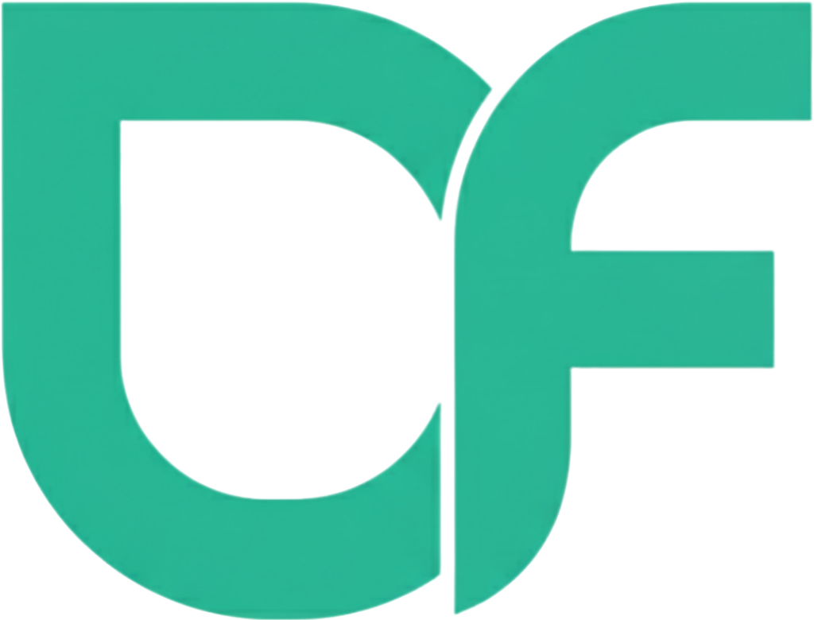

<p align="center">
  
</p>

<h1 align="center">DeepFlav</h1>

<p align="center">
  <strong>DeepFlav: An Integrated Platform for Prediction and Analysis of Flavonoid Biosynthetic Genes across 1,000+ Plant Genomes</strong>
</p>

<p align="center">
  <a href="https://cbi.gxu.edu.cn/KPGF/html/#/">
    
  </a>
  <a href="https://vuejs.org/">
    
  </a>
  <a href="https://www.typescriptlang.org/">
    
  </a>
  <a href="https://vite.dev/">
    
  </a>
</p>

---

## Overview

**DeepFlav** is an integrative multi-omics platform designed for flavonoid biosynthesis research across more than 1,000 plant species. It combines large-scale genomic data with computational prediction tools to facilitate the discovery and functional annotation of flavonoid-related enzymes, including **glycosyltransferases (GTs)**, **acyltransferases (ATs)**, and **methyltransferases (MTs)**.

The platform provides researchers with a unified environment to browse species-specific genomic data, perform sequence-level enzyme classification using the ESM-2 protein language model, visualize metabolic pathways, conduct BLAST-based homology searches, and explore protein structures through interactive 3D molecular viewers.

## Key Features

| Feature | Description |
|---------|-------------|
| **Multi-species Genomic Data** | Curated flavonoid gene annotations across 1,031 plant species spanning 26 taxonomic classes, covering over 630,000 flavonoid-related genes |
| **ESM-2 ML Prediction** | Deep learning-based enzyme classification (GT/AT/MT) using the ESM-2 protein language model, providing family-level prediction with calibrated confidence scores |
| **BLAST Integration** | Real-time sequence alignment against UniProt/Swiss-Prot for functional evidence retrieval and homology-based annotation |
| **AlphaFold 3D Viewer** | Automated protein structure retrieval from AlphaFold DB with interactive molecular visualization (Mol*/NGL) for pocket and functional site analysis |
| **Flavonoid Pathway Maps** | Interactive SVG-based metabolic pathway diagrams with enzyme-specific views (GT, AT, MT) supporting zoom and pan |
| **Gene Search** | Cross-species gene retrieval with keyword, species, and pathway-based filtering |
| **Primer Design** | Integrated Primer3-based primer design tool for experimental validation workflows |
| **Statistical Dashboards** | ECharts-powered species distribution and flavonoid gene category analytics |

## Architecture

```
DeepFlav Frontend (Vue 3 + TypeScript)
├── HomeView              # Platform overview, statistics, model plants, pathway maps
├── MLprediction          # ESM-2 enzyme classification with AlphaFold integration
├── BlastView             # BLAST sequence alignment interface
├── gene-search           # Cross-species gene search
├── species-genome        # Species genome browser
├── species-table         # Species data table with filtering
├── pathway               # Pathway browsing with Cytoscape.js
├── flavonoid-map         # Interactive flavonoid metabolic map
├── PrimerDesigner        # Primer3 primer design tool
└── ContactView           # Contact and citation information
```

## Tech Stack

| Layer | Technology |
|-------|-----------|
| **Framework** | Vue 3 (Composition API + `<script setup>`) |
| **Language** | TypeScript 5.7 |
| **Build Tool** | Vite 6 |
| **State Management** | Pinia |
| **Routing** | Vue Router 4 |
| **Charts** | ECharts 5 |
| **Network Visualization** | Cytoscape.js |
| **3D Molecular Viewer** | Mol* / NGL Viewer |
| **HTTP Client** | Axios |
| **Data Export** | SheetJS (XLSX) |

## Project Structure

```
frontend/
├── src/
│   ├── assets/          # Static assets (images, SVG pathway maps, JSON data)
│   ├── components/      # Reusable components (Header, Footer, CytoscapePathway, etc.)
│   ├── router/          # Vue Router configuration
│   ├── stores/          # Pinia state modules
│   └── views/           # Page components
│       ├── HomeView.vue
│       ├── MLprediction.vue
│       ├── BlastView.vue
│       ├── gene-search.vue
│       ├── species-genome.vue
│       ├── species-table.vue
│       ├── pathway.vue
│       ├── flavonoid-map.vue
│       ├── PrimerDesigner.vue
│       └── ContactView.vue
├── public/              # Static data files and index
├── package.json
├── vite.config.ts
└── tsconfig.json
```

## Data Availability

The full dataset (gene annotations, search indices, and pathway data) is served through the live platform at:

> **https://cbi.gxu.edu.cn/KPGF/html/#/**

The data directories (`fla-data/`, `web_data/`, `gene-index.json`) are excluded from this repository due to their size. Researchers interested in bulk data access should refer to the live platform or contact the authors.

## Citation

If you use DeepFlav or its data in your research, please cite:

> *[Citation information will be updated upon publication]*

## License

This project is licensed under the MIT License. See the [LICENSE](LICENSE) file for details.

## Contact

For questions, collaborations, or bug reports, please visit the [Issues](../../issues) page or contact us through the platform's [Contact page](https://cbi.gxu.edu.cn/KPGF/html/#/contact).

---

<p align="center">
  <sub>Developed at the <strong>College of Life Science and Technology, Guangxi University</strong></sub>
</p>
